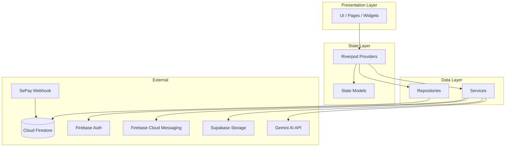
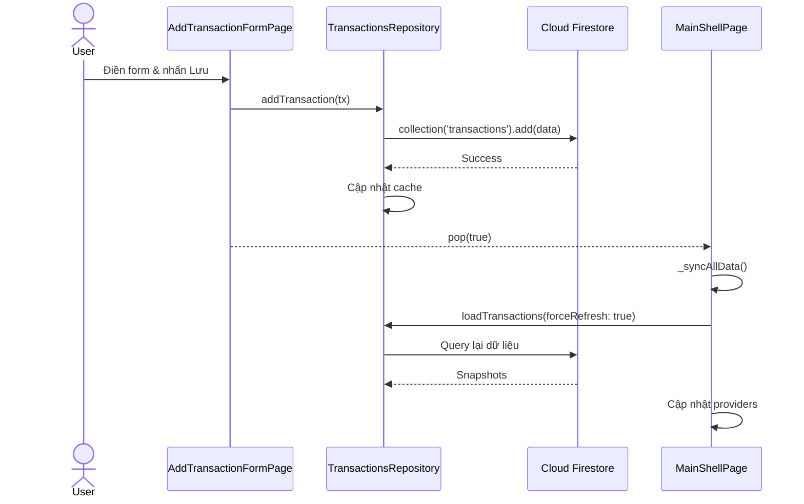
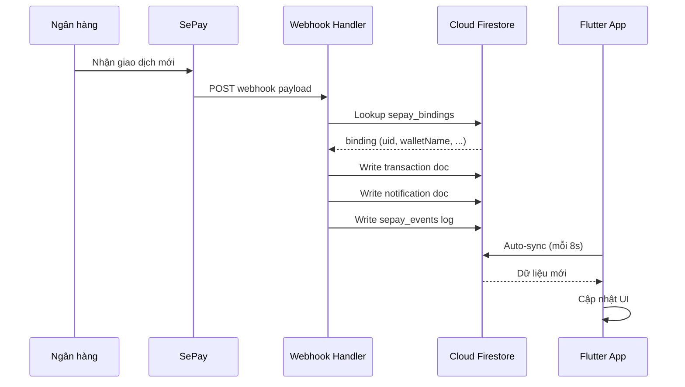
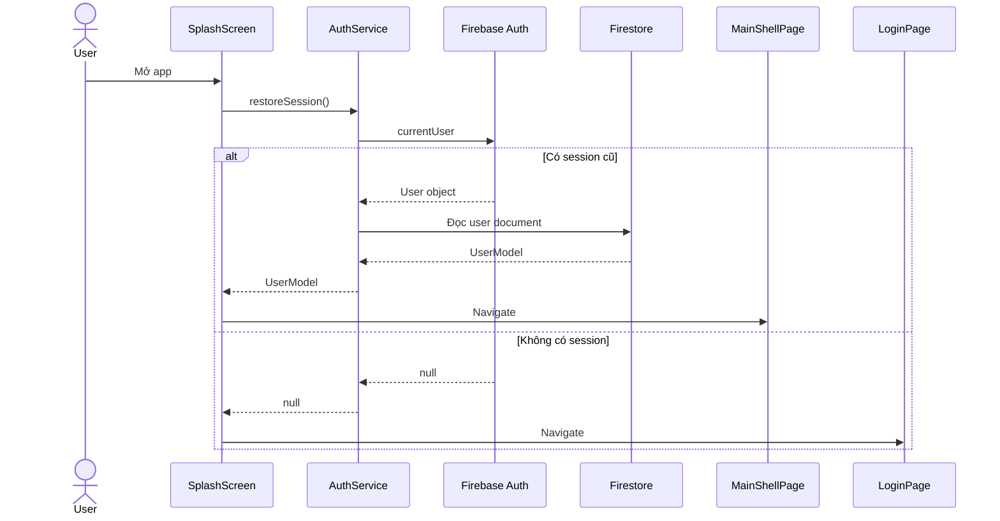

# 📐 Kiến trúc hệ thống — G13 Money

## 1. Tổng quan kiến trúc

G13 Money sử dụng kiến trúc **Feature-First** (hay Feature-Based Architecture) kết hợp với **Riverpod** cho state management. Mỗi feature là một module độc lập chứa đầy đủ UI, state, data, và models.



## 2. Các tầng kiến trúc

### 2.1 Presentation Layer (UI)

> Chứa toàn bộ giao diện người dùng: Pages, Screens, Widgets.

- Sử dụng **Material Design 3** với `ColorScheme.fromSeed()`
- Hỗ trợ **Light/Dark theme** thông qua `ThemeService`
- Tất cả text đa ngôn ngữ qua `LanguageService.tr(vi:, en:)`
- Responsive layout với `CustomScrollView`, `SliverAppBar`, flex widgets

**Quy tắc:**
- Không chứa business logic trong widget
- Sử dụng `ConsumerWidget` / `ConsumerStatefulWidget` để đọc state
- Mỗi trang có file riêng biệt

### 2.2 State Layer (Riverpod)

> Quản lý trạng thái ứng dụng với Riverpod.

```dart
// Ví dụ: Provider cho danh sách giao dịch
final transactionsControllerProvider = StateProvider<List<MoneyTransaction>>(
  (ref) => [],
);

// Ví dụ: Provider cho tab đang chọn
final shellSelectedIndexProvider = StateProvider<int>(
  (ref) => MainShellPage.overviewTab,
);
```

**Các loại provider sử dụng:**
| Provider | Mục đích |
|---|---|
| `StateProvider` | State đơn giản (index tab, danh sách cache) |
| `StateNotifierProvider` | State phức tạp với logic update |
| `Provider` | Computed values, services singleton |

### 2.3 Data Layer (Repository Pattern)

> Tầng truy cập dữ liệu, trừu tượng hóa Firestore operations.

Mỗi feature có Repository class riêng:

```
TransactionsRepository   → users/{uid}/transactions
BudgetsRepository        → users/{uid}/budgets
AccountsRepository       → users/{uid}/accounts
CategoriesRepository     → users/{uid}/categories
```

**Repository Pattern:**

```dart
class TransactionsRepository {
  static final instance = TransactionsRepository._();
  TransactionsRepository._();
  
  List<MoneyTransaction> _cache = [];
  List<MoneyTransaction> get transactions => _cache;
  
  Future<void> loadTransactions({bool forceRefresh = false}) async { ... }
  Future<void> addTransaction(MoneyTransaction tx) async { ... }
  Future<void> updateTransaction(MoneyTransaction tx) async { ... }
  Future<void> deleteTransaction(String id) async { ... }
}
```

**Đặc điểm:**
- Singleton pattern cho mỗi repository
- In-memory cache để giảm Firestore reads
- `forceRefresh` param để buộc reload từ server
- Denormalized fields (`categoryName`, `walletName`) cho query nhanh

### 2.4 Service Layer

> Chứa business logic không thuộc feature cụ thể nào.

| Service | Trách nhiệm |
|---|---|
| `AuthService` | Đăng nhập, đăng ký, đổi mật khẩu, quản lý session |
| `AiFinanceService` | Gọi Gemini AI API, tạo lời khuyên tài chính |
| `BiometricAuthService` | Xác thực vân tay / FaceID |
| `LanguageService` | Chuyển đổi ngôn ngữ vi/en |
| `ThemeService` | Chuyển đổi dark/light theme |
| `NotificationService` | Thông báo local |
| `PushNotificationService` | Firebase Cloud Messaging |
| `SupabaseStorageService` | Upload file lên Supabase Storage |

## 3. Luồng dữ liệu chính

### 3.1 Luồng thêm giao dịch



### 3.2 Luồng SePay Webhook



### 3.3 Luồng xác thực



## 4. Data Synchronization

Ứng dụng sử dụng cơ chế **periodic auto-sync** thay vì realtime listeners:

```dart
// MainShellPage
void _startAutoSync() {
  _syncTimer = Timer.periodic(const Duration(seconds: 8), (_) {
    _syncAllData();
  });
}
```

**Lý do thiết kế:**
- Giảm số lượng Firestore listeners active
- Kiểm soát được tần suất đọc dữ liệu
- Tránh Firestore billing tăng cao với realtime snapshots

## 5. Theme System

```dart
// app.dart
ThemeData(
  colorScheme: ColorScheme.fromSeed(
    seedColor: const Color(0xFF0D7377),    // Teal chủ đạo
    secondary: const Color(0xFF6C63FF),    // Purple phụ
    tertiary: const Color(0xFF14A085),     // Green accent
    brightness: Brightness.light,
  ),
  useMaterial3: true,
),
```

**Bảng màu chính:**

| Vai trò | Hex | Mô tả |
|---|---|---|
| Primary | `#0D7377` | Teal — màu chủ đạo brand |
| Secondary | `#6C63FF` | Purple — accent cho biểu tượng |
| Tertiary | `#14A085` | Green — gradient header |

## 6. Navigation

Sử dụng **Named Routes** tập trung trong `AppRoutes`:

```dart
abstract final class AppRoutes {
  static const String splash = '/';
  static const String login = '/login';
  static const String home = '/home';
  static const String editProfile = '/edit-profile';
  // ... more routes
  
  static final Map<String, WidgetBuilder> map = { ... };
}
```

**Bottom Navigation** có 5 tabs (index 2 là nút FAB):

| Index | Tab | Page |
|---|---|---|
| 0 | Tổng quan | `OverviewPage` |
| 1 | Giao dịch | `TransactionScreen` |
| 2 | *(FAB)* | `AddTransactionFormPage` |
| 3 | Ngân sách | `BudgetsPage` |
| 4 | Tài khoản | `ProfilePage` |

## 7. Design Patterns sử dụng

| Pattern | Nơi áp dụng |
|---|---|
| **Singleton** | Repositories (`TransactionsRepository.instance`) |
| **Repository** | Tầng data access cho Firestore |
| **Provider** | Riverpod cho dependency injection & state |
| **Observer** | `ConsumerWidget` watch state changes |
| **Strategy** | `AiFinanceService` — fallback local khi AI unavailable |
| **Builder** | `WidgetBuilder` trong route map |
| **Factory** | `UserModel.copyWith()`, model constructors |

## 8. Error Handling Strategy

```
┌─────────────────────────────────┐
│  Firebase operations            │
│  → try/catch FirebaseException  │
│  → Map error code to i18n msg   │
│  → Show SnackBar to user        │
└─────────────────────────────────┘

┌─────────────────────────────────┐
│  AI API calls                   │
│  → try/catch with timeout       │
│  → Fallback to local analysis   │
│  → Never crash, always respond  │
└─────────────────────────────────┘

┌─────────────────────────────────┐
│  Network operations             │
│  → Timeout 20s for API calls    │
│  → Cached data as fallback      │
│  → Graceful degradation         │
└─────────────────────────────────┘
```

## 9. Build Configuration

Biến môi trường được truyền qua `--dart-define-from-file`:

```json
// flutter.env.json
{
  "GEMINI_API_KEY": "...",
  "GEMINI_MODEL": "gemini-1.5-flash",
  "SUPABASE_URL": "...",
  "SUPABASE_ANON_KEY": "..."
}
```

Đọc trong code:
```dart
static const String _apiKey = String.fromEnvironment('GEMINI_API_KEY');
```
