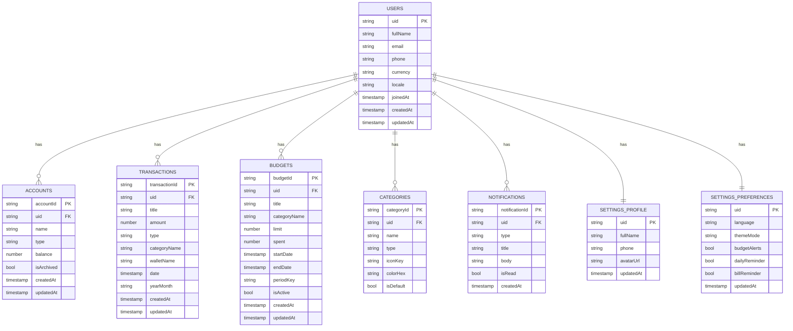

# Firestore Database Schema - G13 Money

Tai lieu nay mo ta cau truc CSDL Firestore de trien khai backend cho ung dung G13 Money.

## Nguyen tac du lieu

- Moi tai khoan nguoi dung chi co 1 node goc: `users/{uid}`.
- Toan bo du lieu cua tai khoan do (thong tin ca nhan, giao dich, ngan sach, vi, danh muc) nam ben duoi node nay.
- Khong tao collection top-level dung chung cho nhieu user nhu `transactions` hoac `budgets` o root.

### Cay du lieu cho 1 tai khoan

```txt
users/{uid}
	- fullName, email, phone, avatarInitials, currency, locale, ...
	/accounts/{accountId}
	/transactions/{transactionId}
	/budgets/{budgetId}
	/categories/{categoryId}
	/notifications/{notificationId}
	/settings/profile
	/settings/preferences
```

## 1. So do tong quan (Mermaid)

```mermaid
flowchart TD
		U[users/{uid}] --> A[accounts/{accountId}]
		U --> T[transactions/{transactionId}]
		U --> B[budgets/{budgetId}]
		U --> C[categories/{categoryId}]
		U --> N[notifications/{notificationId}]
		U --> S1[settings/profile]
		U --> S2[settings/preferences]

		T --> R1[report keys: year, month, day, yearMonth]
		B --> R2[period key: periodKey]
```

## 1.1 So do ER (Bang/Collection + truong)



## 2. Cau truc collection va document

## 2.0 Danh sach bang/collection va truong chinh

| Bang / Collection | Khoa chinh | Truong chinh |
|---|---|---|
| users | uid | fullName, email, phone, currency, locale, joinedAt, createdAt, updatedAt |
| users/{uid}/accounts | accountId | name, type, balance, isArchived, createdAt, updatedAt |
| users/{uid}/transactions | transactionId | title, amount, type, categoryName, walletName, date, yearMonth, createdAt, updatedAt |
| users/{uid}/budgets | budgetId | title, categoryName, limit, spent, startDate, endDate, periodKey, isActive |
| users/{uid}/categories | categoryId | name, type, iconKey, colorHex, isDefault |
| users/{uid}/notifications | notificationId | type, title, body, isRead, createdAt |
| users/{uid}/settings/profile | uid | fullName, phone, avatarUrl, updatedAt |
| users/{uid}/settings/preferences | uid | language, themeMode, budgetAlerts, dailyReminder, billReminder, updatedAt |

### 2.1 `users/{uid}`

| Field | Type | Required | Note |
|---|---|---|---|
| fullName | string | yes | Ten day du |
| email | string | yes | Email dang nhap |
| phone | string | no | So dien thoai |
| avatarInitials | string | no | Chu cai dau de hien thi avatar |
| currency | string | yes | Mac dinh: `VND` |
| locale | string | yes | `vi` hoac `en` |
| joinedAt | timestamp | yes | Thoi diem tao tai khoan |
| createdAt | timestamp | yes | Server timestamp |
| updatedAt | timestamp | yes | Server timestamp |

### 2.2 `users/{uid}/accounts/{accountId}`

| Field | Type | Required | Note |
|---|---|---|---|
| name | string | yes | Vi du: Tien mat, Vietcombank |
| type | string | yes | `cash`, `bank`, `ewallet` |
| balance | number | yes | So du hien tai |
| colorHex | string | no | Mau hien thi, vi du `#0D7377` |
| isArchived | bool | yes | Soft delete |
| createdAt | timestamp | yes | Server timestamp |
| updatedAt | timestamp | yes | Server timestamp |

### 2.3 `users/{uid}/transactions/{transactionId}`

| Field | Type | Required | Note |
|---|---|---|---|
| title | string | yes | Tieu de giao dich |
| note | string | no | Ghi chu |
| amount | number | yes | So tien giao dich |
| type | string | yes | `expense`, `income`, `debt` |
| isIncome | bool | yes | Ho tro logic UI hien tai |
| categoryId | string | no | Tham chieu danh muc |
| categoryName | string | yes | Luu denormalized de query nhanh |
| walletId | string | no | Tham chieu account |
| walletName | string | yes | Luu denormalized de hien thi nhanh |
| date | timestamp | yes | Ngay giao dich |
| attachmentUrls | array<string> | no | URL anh hoa don trong Firebase Storage |
| tags | array<string> | no | Nhan phan loai bo sung |
| year | number | yes | Trich xuat tu `date` |
| month | number | yes | Trich xuat tu `date` |
| day | number | yes | Trich xuat tu `date` |
| yearMonth | string | yes | Dinh dang `YYYY-MM` |
| createdAt | timestamp | yes | Server timestamp |
| updatedAt | timestamp | yes | Server timestamp |

### 2.4 `users/{uid}/budgets/{budgetId}`

| Field | Type | Required | Note |
|---|---|---|---|
| title | string | yes | Ten ngan sach |
| categoryId | string | no | Danh muc ap dung |
| categoryName | string | yes | Denormalized de hien thi/query |
| walletId | string | no | Account ap dung, co the `ALL` |
| walletName | string | yes | Ten vi/tai khoan |
| limit | number | yes | Han muc |
| spent | number | yes | Tong da chi (cache) |
| startDate | timestamp | yes | Bat dau chu ky |
| endDate | timestamp | yes | Ket thuc chu ky |
| periodKey | string | yes | Dinh dang `YYYY-MM` |
| colorHex | string | no | Mau hien thi |
| iconKey | string | no | Key icon de map o app |
| isActive | bool | yes | Bat/tat ngan sach |
| createdAt | timestamp | yes | Server timestamp |
| updatedAt | timestamp | yes | Server timestamp |

### 2.5 `users/{uid}/categories/{categoryId}` (optional)

| Field | Type | Required | Note |
|---|---|---|---|
| name | string | yes | Ten danh muc |
| type | string | yes | `expense`, `income`, `debt` |
| iconKey | string | no | Map icon tren UI |
| colorHex | string | no | Mau danh muc |
| isDefault | bool | yes | Danh muc he thong hay user tao |
| createdAt | timestamp | yes | Server timestamp |
| updatedAt | timestamp | yes | Server timestamp |

### 2.6 `users/{uid}/notifications/{notificationId}`

| Field | Type | Required | Note |
|---|---|---|---|
| type | string | yes | `budget_alert`, `reminder`, `system` |
| title | string | yes | Tieu de thong bao |
| body | string | yes | Noi dung thong bao |
| isRead | bool | yes | Trang thai da doc |
| meta | map<string, dynamic> | no | Du lieu bo sung |
| createdAt | timestamp | yes | Server timestamp |

### 2.7 `users/{uid}/settings/profile`

| Field | Type | Required | Note |
|---|---|---|---|
| fullName | string | yes | Ho ten hien thi |
| phone | string | no | So dien thoai |
| avatarUrl | string | no | URL avatar neu co |
| updatedAt | timestamp | yes | Server timestamp |

### 2.8 `users/{uid}/settings/preferences`

| Field | Type | Required | Note |
|---|---|---|---|
| language | string | yes | `vi`/`en` |
| themeMode | string | yes | `light`/`dark`/`system` |
| budgetAlerts | bool | yes | Canh bao vuot ngan sach |
| dailyReminder | bool | yes | Nhac nhap giao dich hang ngay |
| billReminder | bool | yes | Nhac hoa don |
| updatedAt | timestamp | yes | Server timestamp |

## 3. Chi muc (index) khuyen nghi

### Transactions
- `(date desc)`
- `(yearMonth asc, type asc, date desc)`
- `(categoryName asc, date desc)`
- `(walletId asc, date desc)`

### Budgets
- `(periodKey asc, isActive asc)`
- `(categoryName asc, periodKey asc)`

## 4. Security rules toi thieu

```txt
match /users/{userId} {
	allow read, write: if request.auth != null && request.auth.uid == userId;

	match /{document=**} {
		allow read, write: if request.auth != null && request.auth.uid == userId;
	}
}
```

## 5. Quy uoc dat ten

- Collection/doc id dung `camelCase` cho field.
- `createdAt`, `updatedAt` dung `FieldValue.serverTimestamp()`.
- So tien dung `number` (khong luu string dinh dang tien te).
- Cac field de query tong hop (`yearMonth`, `periodKey`) tao ngay khi ghi document.
